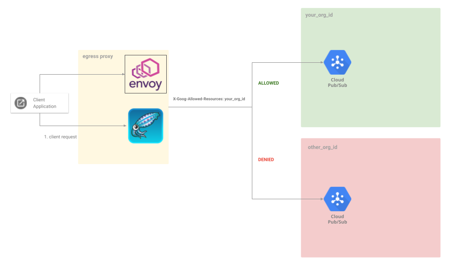

## Restricting GCP API calls with X-Goog-Allowed-Resources header using Envoy and Squid

`Envoy` and `Squid` egress proxy for Google Cloud APIs that restricts API calls to specific Cloud Organizations.

This is a simple demo extending the new GCP Org policy header value that will make sure any API calls are restricted to operating only against resources within your org.

no sense in describing the usecases as you can find it in the official docs:

* [Configure organization restrictions](https://cloud.google.com/resource-manager/docs/organization-restrictions/configure-organization-restrictions)

This tutorial describes two implementations which function in a different way though both require TLS decryption on the proxy.

A) `Envoy Proxy`: `client` --> `envoy` --> `GCP`

   - In this mode, envoy is a [forward proxy](https://www.cloudflare.com/learning/cdn/glossary/reverse-proxy/) the client connects directly to envoy

   - Envoy will decrypt the traffic from the client and add the header.

   - Verified to work for both HTTPS and gRPC traffic

B) `Squid Proxy`: `client` --> `squid` (via `PROXY CONNECT`) --> `GCP`

   - This is also a forward proxy but the client uses HTTP `CONNECT` (`http_proxy=, https_proxy=`) to squid.

   - Squid dynamically issues a cert similar to the upstream GCP service except that the CA that signed it is squid.

   - Squid will decrypt the traffic from the client and add the HTTP header.

   - Verified to work only over HTTPS

---

The following will demonstrate configurations using curl, envoy and squid



### curl

First just verify the basics using curl.

Assume you have access to read the pubsub topics in a given project in your organization.

```bash
# first get your orgid
$ gcloud organizations list
DISPLAY_NAME               ID  DIRECTORY_CUSTOMER_ID
someorganiazation.com  673208786098              C023zwcc8

# create a filew using that orgid
cat <<EOF > authorized_orgs.json
{
  "resources": [
    "organizations/673208786011"
  ],
  "options": "strict"
}
EOF
 
# get the encoded header value
export RES=`cat authorized_orgs.json | basenc --base64url -w0`
echo $RES
export PROJECT_ID=`gcloud config get-value core/project`
 
# access curl
curl -s -H "X-Goog-Allowed-Resources: $RES" -H "Authorization: Bearer `gcloud auth print-access-token`" https://pubsub.googleapis.com/v1/projects/$PROJECT_ID/topics
{
  "topics": [
    {
      "name": "projects/PROJECT_ID/topics/topic1"
```

if you enter in any other org id, you should see a failure
```json
{
  "error": {
    "code": 403,
    "message": "Access denied by organization restriction. Please contact your administrator for additional information.",
    "status": "PERMISSION_DENIED",
    "details": [
      {
        "@type": "type.googleapis.com/google.rpc.ErrorInfo",
        "reason": "ORG_RESTRICTION_VIOLATION",
        "domain": "googleapis.com",
        "metadata": {
          "consumer": "projects/32555940559",
          "service": "pubsub.googleapis.com"
        }
      }
    ]
  }
}
```

or if malformed:

```json
{
  "error": {
    "code": 400,
    "message": "Org Restriction Header is not valid. Please pass a valid Org Restriction Header.",
    "status": "INVALID_ARGUMENT",
    "details": [
      {
        "@type": "type.googleapis.com/google.rpc.ErrorInfo",
        "reason": "ORG_RESTRICTION_HEADER_INVALID",
        "domain": "googleapis.com",
        "metadata": {
          "consumer": "projects/32555940559",
          "service": "pubsub.googleapis.com"
        }
      }
    ]
  }
}
```

### Envoy

Now test with envoy:

#### HTTP

on linux:

```bash
cd envoy/
docker cp `docker create envoyproxy/envoy-dev:latest`:/usr/local/bin/envoy /tmp/
./envoy -c envoy_server.yaml -l debug

# new window
export PROJECT_ID=`gcloud config get-value core/project`

curl -v -H "Host: pubsub.googleapis.com" \
  --connect-to pubsub.googleapis.com:443:127.0.0.1:8081 \
  --cacert ../certs/tls-ca.crt \
  -H "Authorization: Bearer `gcloud auth application-default print-access-token`" \
     https://pubsub.googleapis.com/v1/projects/$PROJECT_ID/topics
```

#### GRPC

Envoy natively supports GRPC and can add on the header pretty easily.

To use this mode, just run the pubsub GRPC Client:

```bash
cd client/
go run main.go --projectID $PROJECT_ID
```

I intentionally discretely only allowed pubsub to call the 'list' api just to only allow that through:

```yaml
            virtual_hosts:          
            - name: pubsub_service
              domains: ["pubsub.googleapis.com"]
              routes:
              - match:
                  prefix: "/v1/projects/"         
                route:
                  cluster: dynamic_forward_proxy_cluster
                typed_per_filter_config:
                  envoy.filters.http.dynamic_forward_proxy:
                    '@type': type.googleapis.com/envoy.extensions.filters.http.dynamic_forward_proxy.v3.PerRouteConfig
              - match:
                  path: "/google.pubsub.v1.Publisher/ListTopics"  
                  grpc: {}            
                route:
                  cluster: dynamic_forward_proxy_cluster
                typed_per_filter_config:
                  envoy.filters.http.dynamic_forward_proxy:
                    '@type': type.googleapis.com/envoy.extensions.filters.http.dynamic_forward_proxy.v3.PerRouteConfig         
```

Some other references

- [gRPC TLS Tunnel proxy using CONNECT](https://github.com/salrashid123/envoy_grpc_tls_bridge)
- [Distributed HTTP Proxy on Google Cloud using Terraform](https://github.com/salrashid123/envoy_remote_proxy)

Just note that envoy doens't work with CONNECT _and_ dynamic certificates/ssl_bump for CONNECT yet.  see ( [issue 18928](https://github.com/envoyproxy/envoy/issues/18928)).  

Note that for grpc and http, you can directly inject this header too from the client similar to the curl example

for grpc:

```golang
ctx = metadata.AppendToOutgoingContext(ctx, "x-goog-allowed-resources", "ewogICJyZXNv...")
```


#### Squid

Squid can add on http headers pretty easily once it decrypts the TLS session.

Note that squid here will not transparently forward the socket through to GCP:  it actually needs to decrypt the TLS session...which means each client needs to trust the TLS CA running on squid (well, you needed that for envoy too)

The specific squid configuration is in `squid.conf.intercept`:


```
visible_hostname squid.yourdomain.com

http_port 3128 ssl-bump generate-host-certificates=on cert=/apps/tls-ca.crt key=/apps/tls-ca.key

always_direct allow all
acl excluded_sites ssl::server_name .wellsfargo.com
acl httpbin_site ssl::server_name httpbin.org
acl pubsub_site ssl::server_name pubsub.googleapis.com
ssl_bump splice excluded_sites
ssl_bump bump all

request_header_add foo "bar" httpbin_site

request_header_add X-Goog-Allowed-Resources "ewogICJyZXNvdXJjZXMiOiBbCiAgICAib3JnYW5pemF0aW9ucy82NzMyMDg3ODYwOTgiCiAgXSwKICAib3B0aW9ucyI6ICJzdHJpY3QiCn0K" pubsub_site

sslproxy_cert_error deny all
sslcrtd_program /apps/squid/libexec/security_file_certgen -s /apps/squid/var/lib/ssl_db -M 4MB sslcrtd_children 8 startup=1 idle=1
```


If you want to test this with your own org, just replace the  value of `X-Goog-Allowed-Resources`.

The configuration above will add on a sample header for httpbin:

As a demo:


start squid docker daemon...i happen to have one here for a number of years:

* [squid Proxy dockerfile](https://github.com/salrashid123/squid_proxy)


```bash
cd squid/
export DIR=`pwd`
export PROJECT_ID=`gcloud config get-value core/project`

docker run --net=host -p 3128:3128 -v $DIR/../certs/:/certs/ -v $DIR:/config/ -ti docker.io/salrashid123/squidproxy /apps/squid/sbin/squid -NsY -f /config/squid.conf.intercept
```


Then issue a curl command in a new window

```bash
cd squid/
curl -v --proxy-cacert../certs/tls-ca.crt  -x localhost:3128  https://httpbin.org/get
```

What you should see is a `CONNECT` to squid, then squid will download a cert that looks just like httpbin's real one but is issued locally...

then when the client does connect to squid using a new socket, squid will decode the tls session add onthe foo header key value

```text
$ curl -v --proxy-cacert $DIR/../certs/tls-ca.crt --cacert $DIR/../certs/tls-ca.crt  -x localhost:3128  https://httpbin.org/get
*   Trying 127.0.0.1:3128...
* Connected to localhost (127.0.0.1) port 3128 (#0)
* allocate connect buffer
* Establish HTTP proxy tunnel to httpbin.org:443
> CONNECT httpbin.org:443 HTTP/1.1
> Host: httpbin.org:443
> User-Agent: curl/7.85.0
> Proxy-Connection: Keep-Alive
> 
< HTTP/1.1 200 Connection established
< 

* Proxy replied 200 to CONNECT request
* CONNECT phase completed
* ALPN: offers h2
* ALPN: offers http/1.1
*  CAfile: /home/srashid/Desktop/org_header_restrict/squid/../certs/tls-ca.crt
*  CApath: /etc/ssl/certs

* SSL connection using TLSv1.3 / TLS_AES_256_GCM_SHA384
* ALPN: server did not agree on a protocol. Uses default.
* Server certificate:
*  subject: CN=httpbin.org
*  start date: Jan  9 22:05:43 2022 GMT
*  expire date: Jan  9 22:05:43 2032 GMT
*  subjectAltName: host "httpbin.org" matched cert's "httpbin.org"
*  issuer: C=US; O=Google; OU=Enterprise; CN=Enterprise Subordinate CA       <<<<<<<<<< look, its issued by squid
*  SSL certificate verify ok.


> GET /get HTTP/1.1
> Host: httpbin.org
> User-Agent: curl/7.85.0
> Accept: */*
> 

< HTTP/1.1 200 OK
< Date: Mon, 21 Nov 2022 16:55:14 GMT
< Content-Type: application/json
< Content-Length: 326
< Server: gunicorn/19.9.0
< Access-Control-Allow-Origin: *
< Access-Control-Allow-Credentials: true
< X-Cache: MISS from squid.yourdomain.com
< Via: 1.1 squid.yourdomain.com (squid/5.7)
< Connection: keep-alive
< 
* TLSv1.2 (IN), TLS header, Supplemental data (23):
{
  "args": {}, 
  "headers": {
    "Accept": "*/*", 
    "Cache-Control": "max-age=259200", 
    "Foo": "bar",                                 <<<<<<<<<<<<< new header added in
    "Host": "httpbin.org", 
    "User-Agent": "curl/7.85.0", 
    "X-Amzn-Trace-Id": "Root=1-637bad72-5c4919b62e64989759b3c7ab"
  }, 
  "origin": "127.0.0.1, 108.56.239.251", 
  "url": "https://httpbin.org/get"
}

```


then finally call pubsub

```
curl -v --proxy-cacert ../certs/tls-ca.crt \
   --cacert ../certs/tls-ca.crt \
   -x localhost:3128 \
   -H "Authorization: Bearer `gcloud auth application-default print-access-token`" \
    https://pubsub.googleapis.com/v1/projects/$PROJECT_ID/topics
```


---

### References

* [squid Proxy dockerfile](https://github.com/salrashid123/squid_proxy)
* [Squid proxy cluster with ssl_bump on Google Cloud](https://github.com/salrashid123/squid_ssl_bump_gcp)
* [Content Adaptation with ssl_bump](https://github.com/salrashid123/squid_proxy/tree/master/content_adaptation)
* [Using proxy servers with Google Cloud Client Libraries](https://blog.salrashid.dev/articles/2021/using_proxy_servers/)
* [Envoy Dynamic Forward Proxy configuration with Downstream SNI for Google APIs and httpbin](https://github.com/salrashid123/envoy_dynamic_forward_proxy_with_sni)
* [Envoy External Processing filter for decoding Google gRPC PubSub Messages](https://github.com/salrashid123/envoy_gcp_grpc)